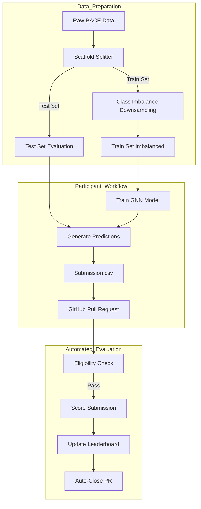

# GNN Mini-Challenge: BACE Inhibition Prediction

Welcome to the GNN Mini-Challenge! Your task is to build a Graph Neural Network that can predict whether a molecule will inhibit the BACE-1 enzyme, a key target in Alzheimer's disease research.
This challenge is not just about getting the highest score, but about exploring how GNNs can learn meaningful chemical properties directly from a molecule's structure.


## Competition Workflow



## The Challenge Philosophy: Why Only SMILES?

In many machine learning tasks, you are given a rich table of pre-calculated features. In this challenge, we are doing something different.

You are provided with only one primary piece of information for each molecule: its SMILES string. We have intentionally removed all other molecular descriptors (like PSA, MolLogP, etc.).

**Why?**

Our goal is to test the power of representation learning. Instead of giving the model the "answers" (pre-calculated features), we want your GNN to discover them on its own. The model must learn to infer chemical properties—like polarity, reactivity, and steric effects—by analyzing the graph of atoms and bonds. This is a much harder but more powerful and generalizable approach.

Your challenge is to build a GNN that can act like a computational chemist, deriving its own insights from the raw molecular blueprint.

## About the Data

The dataset for this challenge is derived from the BACE dataset from the widely-used MoleculeNet benchmark suite.

    Original Dataset: BACE Dataset on MoleculeNet
    Biological Context: BACE-1 (β-secretase 1) is an enzyme involved in the production of amyloid-beta peptides, which are a key component of the plaques found in the brains of Alzheimer's patients. Inhibiting BACE-1 is a major strategy in developing treatments for Alzheimer's disease.
    Task: Binary classification. Predict if a molecule will inhibit BACE-1 (1 for active, 0 for inactive).

### Provided Files

     

The data is located in the data/public/ directory and is split into node and edge files for both training and testing sets. 

     train_nodes.csv & train_edges.csv: The graph structure for the training molecules.
     train_labels.csv: The target labels for the training set.
     test_nodes.csv & test_edges.csv: The graph structure for the test molecules.
     sample_submission.csv: An example of the submission format.
     


### Graph Specification

To align with standard GNN formulation:

-   **Node Feature Matrix ($X$)**:
    -   Provided in `train_nodes.csv` and `test_nodes.csv`.
    -   Each row corresponds to a node $v_i$.
    -   Columns `nf_0` to `nf_7` represent the feature vector $x_i$ (One-hot encoded atom type, dim=8).

-   **Adjacency Matrix ($A$)**:
    -   Provided in `train_edges.csv` and `test_edges.csv`.
    -   Represented as a sparse Edge List (COO format).
    -   Columns `src` and `dst` define the edges $(u, v)$ such that $A_{uv} = 1$.
    -   The graph is undirected.


### Data Challenges

To make this a realistic challenge, the data includes: 

     Class Imbalance: The training set is heavily imbalanced (~10% active) to mimic real-world screening. The test set follows a different distribution.
     Distribution Shift: The dataset uses a **Scaffold Split**, meaning the test set contains molecules with different chemical backbones than the training set. Your model must generalize to new chemical space!
     Variable Graph Sizes: Molecules have different numbers of atoms and bonds, so your model must handle batched graphs of varying sizes.
     

## Problem Type

Graph Classification: Given a molecule (represented by its SMILES string), predict if it is active (1) or inactive (0) against BACE-1.


## The Task: Graph Classification 

Your goal is to solve a graph classification problem. Your GNN must analyze the provided node and edge data to predict the target class for each graph.

## Evaluation: The Macro F1-Score 

Submissions will be ranked by the Macro F1-Score. This metric is essential here because it calculates the F1-score for each class independently and then averages them, giving equal importance to both the minority (active) and majority (inactive) classes.

**Ranking Policy**: We follow Kaggle guidelines—tied scores share the same rank (e.g., if two teams have the top score, both are Rank 1, and the next team is Rank 3).

## 📊 Leaderboard 

The leaderboard is automatically updated after each submission is scored. It ranks all submissions by their Macro F1-Score in descending order. 

Click here to see the current leaderboard : [Leaderboard](https://hadilaff.github.io/GNN_BACE_Challenge/leaderboard.html) 
How to Get Started 

Ready to dive in? It only takes a few minutes to get a baseline model running. 

   1. Clone the Repository:
``` code
git clone https://github.com/hadilaff/GNN_BACE_Challenge
cd gnn-challenge
```
   2. Set Up Your Environment (a virtual environment is highly recommended):
   ``` code
   pip install -r requirements.txt
``` 
   3. Run the Baseline Model: 
   ``` code
   cd starter_code
   python baseline.py
   ``` 
This will train a simple Graph Convolutional Network (GCN) and generate a submission.csv in the submissions/inbox/ directory. This score is the one to beat!

## Submission Format 

To submit your results, create a CSV file with two columns: id and target. Place your submission file in the submissions/inbox/ directory and create a pull request.

> [!NOTE]
> **Automated Scoring**: Your PR will be automatically scored by GitHub Actions. If successful, your score will be added to the leaderboard and the PR will be **closed automatically** (it will not be merged).
 
``` text

id,target
BACE_1234,0
BACE_1235,1
...
```

### Submission Policy

> [!WARNING]
> **One Submission Rule**: To encourage thoughtful model design, each participant is allowed **only one successful submission**.

Once your submission is scored and appears on the leaderboard, you cannot submit again. Please verify your model locally before submitting!


### Repository Structure 
``` text
gnn-challenge/
├── data/
│   └── public/             # All public challenge data
│       ├── train_nodes.csv
│       ├── train_edges.csv
│       ├── train_labels.csv
│       ├── test_nodes.csv
│       ├── test_edges.csv
│       └── sample_submission.csv
├── competition/             # Scoring and validation logic
│   ├── config.yaml
│   ├── evaluate.py
│   └── render_leaderboard.py
    └── check_eligibility.py
├── starter_code/           # Baseline model & dependencies
│   ├── baseline.py
├── submissions/
│   └── inbox/             # Place your submission CSVs here
├── leaderboard/           # Auto-updated rankings
│   ├── leaderboard.csv
│   └── leaderboard.md
├── .github/workflows/     # Automation for scoring & leaderboard
├── README.md
└── requirements.txt
└── requirements.txt
└── LICENSE                
```

### Tips for Success 

     Looking for an edge? Here are some ideas to explore: 

     Experiment with Architectures: The baseline uses a GCN. Try different GNN layers like GAT (Graph Attention Network) or GraphSAGE to see how different message-passing strategies perform.
     Feature Engineering: The baseline uses one-hot encoded atomic numbers. Can you add more expressive features for atoms (e.g., formal charge, hybridization) and bonds (e.g., aromaticity)?
     Tune Hyperparameters: Systematically tune the learning rate, number of layers, hidden dimensions, and dropout rate.
     Prevent Overfitting: With a small dataset, overfitting is a real risk. Use techniques like dropout and early stopping.
     
     

Good luck, and happy graph learning!     